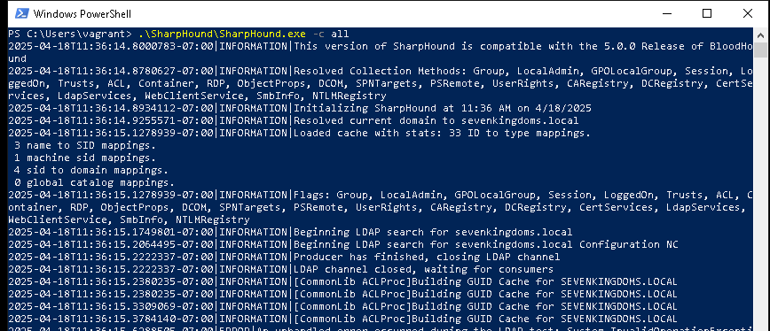
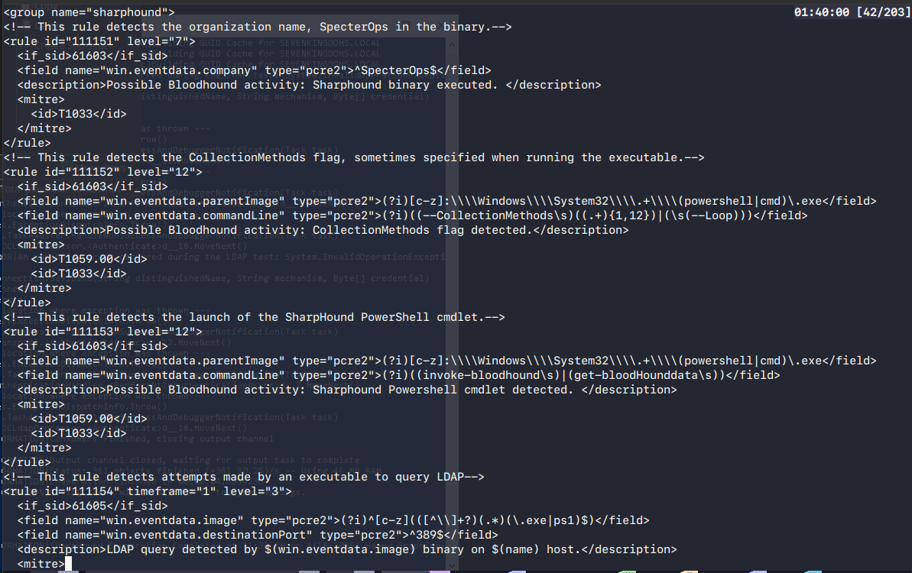

---
title: "Ethical Hacking Assignment"
author: [HAN23080181, HAN23080514, HAN23100188, HAN23100107, HAN23080227]
date: '2025-03-30'
toc: true
toc-own-page: true
lang: "en"
titlepage: true,
titlepage-text-color: "FFFFFF"
titlepage-rule-color: "360049"
titlepage-rule-height: 0
titlepage-background: "background.pdf"
...

# **Title: Defensive Strategies Against the 5 Phases of Ethical Hacking: A Security Perspective**

# **1.Introduction**
Cybersecurity threats are one of the major problems in different countries including strong technological thriving countries such as United State, United Kingdom, and Russia, which target individual, businesses, and governments, causing financial losses, reputational damage, and operational disruptions.
As organizations continue to store vast amounts of sensitive data, Ethical Hacking plays a crucial role in cybersecurity to protect the information of company and customers by simulating real-world attack to identify vulnerabilities within systems, networks, and applicators. The goal of Ethical Hacking is to understand mindset or tactic of attackers to strengthen security and implement effective countermeasures.

**Ethical Hacking is structured into five stage that mimic attack circuition:**
1. Reconnaissance: Collecting target data such as IP address, or network detail by scanning techniques.
2. Scanning and Enumeration: Analyzing vulnerabilities of target system using tool like Nmap and Nessus.
3. Gaining access: Gaining unauthorized access to target system through brute-force attack, SQL injection, misconfiguration.
4. Maintaining access: Enhancing access by deploying backdoor, rootkits, or others stealth techniques can avoid detection.
5. Cover track: Clearing track to evade detection.

# **2.Main body**
##  2.1 What is Ethical Hacking?
### 2.1.1 Introduction to Ethical Hacking
Ethical hacking or **penetration testing**, or **white-hat hacking**, or **offensive security testing**, is the name for the system security inspection process of an organization or government through emulating an actual attack on the system of that organization. This action is taken to examine and identify potential security weakness existing in the system that can be exploited by malicious actors.
Ethical hacking has become an essential cornerstones in modern cybersecurity framework due to the development of cyber threats is increasingly complicated and difficult to solve, providing organizations or governments to detect and overcome potential weakness.

### 2.1.2 Definition and Scope
Ethical hacking is the use of exploitation techniques by ethical hacker or friendly parties in an attempt to discover, identify, understand and repair security weakness in a network, computer system, or organization's system before threat actors can exploit them.

The practice encompasses the following scopes:
- Network infrastructure testing
- Web and mobile application penetration testing
- Wireless security assessments
- Cloud service configuration audits
- Physical and social engineering attacks (within red team exercises)

### 2.1.3 Objectives of Ethical Hacking
Objectives of Ethical Hacking:
- Identifying Security Vulnerabilities: Detect the security vulnerabilities existing in organization's system, network, and applications that may be exploited.
- Risk Assessment and Prioritization: Examine the system defence and impact of identified weakness based on industry standards.
- Compliance Assurance: Meet the requirements and regulations in the contract.
- Incident Response Readiness: Simulate the cyberattack to examine the efficiency of organization's detection and mitigation procedures.
- Security Posture Improvement: Give direction and enhance the effectiveness of the system resilience.

### 2.1.4 Ethical and Legal Considerations
Ethical hackers must obey the laws, consensus as well as organization policies. Any deviation from the term that have been signed between the two parties can constitute the law violation such as:
- Computer Fraud and Abuse Act (CFAA) – United States
- General Data Protection Regulation (GDPR) – European Union
- Computer Misuse Act 1990 – United Kingdom

Before the inspection was conducted, a contract also know as **Rules of Engagement (RoE) document** must be signed. This document outline:
- Testing scope and exclusions
- Authorized tools and techniques
- Testing schedule
- Notification and escalation protocols

In short, ethical hacker must comply with the principle to avoid leaked sensitive information, and the effects may occur when the information is leaked, ensuring data confidentiality, integrity and availability.

##  2.2 What is Active Directory(AD)?
### 2.2.1 Introduction to Active Directory (AD).
Active directory is a eraction of different hierarchies developed by Microsoft that serves as the backbone of identity and access management (IAM) in Windows-based enterprise networks, enabling administrators to manage information stored on the network such as user data, security, and distributed resources  more efficient.

### 2.2.2 Core Components of Active Directory.
#### 2.2.2.1 Active Directory Domain Services (AD DS).
A directory services knows as Active Directory Domain Services (AD DS), enabling directory data such as authentication(names, passwords, phone numbers), user logon processes, and directory searches can be stored and available across network users and administrators. In addition, AD DS improve the effectiveness in resources management and security policies.

#### 2.2.2.2 Domain Controllers (DCs).
Domain Controllers work as a brain controlling AD DS including security policies and directory data. Moreover, they approve and validate all clients and components in Windows domain network.

#### 2.2.2.3 Organizational Units (OUs).
Organizational Units (OUs) has the lowest rank in the decentralization system of AD and the smallest administrative units in Domain that function as a container to store directory objects such as users, group, computers, and other components. OUs are the smallest gear in the system but also the most important for the system to operate smoothly and effectively.

#### 2.2.2.4 Group Policy Objects (GPOs).
Group Policy Objects (GPOs) is a set of setting that implemented defence policies to Active Directory environment to manage thousands of users and devices across Directory domain. Thus, enforcing organizational standards and security compliance.

Purpose and Application:
- Centralized Configuration Management: Allow administrators to implement regular configurations to users have been created in the environment in a defined scope (site, domain, or OU).
- User Configuration Settings: Including guiding related to AD environment such as desktop environment, network connections, software installation, folder redirection, and logon/logoff scripts.
- Computer Configuration Settings: 
- Security Enforcement: Including policies for startup/shutdown scripts, Windows security settings, registry settings, and service control.
- Software Deployment: GPOs act function as crucial part in Directory domain helping automate the installation, update, or removal of software applications across multiple machines. 
- Loopback Processing: Useful in environments like kiosks or classrooms, where a user’s settings are overridden by the computer’s GPO regardless of who logs in.

GPO Processing Order (LSDOU):
When multiple GPOs are in place, they are applied in the following order:
1. Local GPO
2. Site-level GPOs
3. Domain-level GPOs
4. OU-level GPOs (from parent to child)

If settings conflict, those applied later in the sequence (e.g., at the OU level) take precedence.

### 2.2.3 Security and Authentication.
Active Directory (AD) own strong security and authentication through various network protocols, including the three most important protocols are Kerberos, LDAP, and NTML - collectively ensure that users and devices are authenticated securely and efficiently, enabling access control across an organization’s infrastructure.

#### 2.2.3.1 Kerberos Authentication Protocol.
Kerberos is the essential protocol of Active Directory in Domain environments, acting as a mediator for trusted hosts and untrusted network to secure communication between two parties such as authenticating service.

Key features:
- Ticket-Based Authentication: Key Distribution Center (KDC), which is a part of domain controller, providing ticket issued for Kerberos to operate.
- Mutual Authentication: Authentication is performed in parallel between client and server, in order to mitigate the risk of impersonation attacks.
- Time-Sensitive Tokens: Kerberos tickets have expiration timestamps, reducing the risk of token reuse or replay attacks.

#### 2.2.3.2 LDAP (Lightweight Directory Access Protocol).
LDAP or Lightweight Directory Access Protocol is an open and neutral protocol using in AD to manage directory services and become a central location for accessing, providing communication language that applications require to send and receive information from directory services.

Key Functions in AD:
- Directory Searches: LDAP is used to look up directory objects such as users, groups, or computers.
- Authentication and Authorization: LDAP can validate credentials and determine access rights based on user attributes.
- Directory Modification: Using LDAP to add, delete, or modify AD objects.

#### 2.2.3.3 NTLM (NT LAN Manager).
NTML is one of the old protocols applied before Kerboros. While the modern Active Directory environment is still priority Kerberos rather than NTML, they still use NTML to help old systems do not support Kerberos compatible with the environment.

NTLM Characteristics:
- Uses a challenge-response mechanism for authentication.
- Does not provide mutual authentication, making it vulnerable to relay attacks.
- Still used in workgroup environments, local logons, and when Kerberos is unavailable.

##  2.3 What is HoneyPot?

Honeypots are fake services designed to be decoys to attract, surveil and identify potential threat actors. These decoys are deliberately vulnerable and exposed by design. (Crowdstrike)

##  2.4 Reconnaissance
Reconnaissance is the first step of cyberattack where threat actors try to gather information of target's system without direct interaction. In defensive site, blue team will try to reduce exposure of sensitive data in documents or code by minimizing publicly available data and deploying early detection mechanisms such as Honeypots, Wazuh.

Honeypot function as a decoy in network to distract potential attacker from essential data and machine in Directory domain. Combining Wazuh with Honeypot to analyze, correlate, and respond to these early signals. When Honeypot is being triggered, Wazuh will automate IP blocking and send real-time alerts to defenders of unauthorized access attempts

This combination of deception and correlation allows defenders to detect reconnaissance activities early, manage external exposure, and engage proactively before attackers escalate their operations.

##  2.5 Scanning and Enumeration
Scanning is the next step of cyberattack. In this phase, attackers try to identify open ports, live hosts, and services of target's system by probing the network environment.

In this phase, blue team implements network segmentation, firewalls, Access Control Lists (ACLs), and protocol such as **Zero Trust** principle to limit lateral movement. The goal of these actions is to trap and monitor scanning tools such as Nmap or Masscan.

Additionally, the combination between Wazuh and Honeypot enables security teams to detect known scanning behaviors, such as SYN floods or banner grabbing. When attackers attempt to scan the environments, Wazuh can automatically response to the unauthorized IP address, blocking the source IP and notify administrators.

In short, thanks to Honeypot and Wazuh, Blue Teams can detect, trace, and disrupt scanning attempts early—preventing attackers from building a useful map of the network.

##  2.6 Initial foothold.

Once the attackers had enough information, they would begin to gain foothold on the network by targeting external facing services such as RDP (Remote Desktop Protocol), Citrix, webapps, etc. In this case, the attackers managed to find an open RDP port on the external IP like the case of lapsus$. To deal with RDP abuse, this service shouldn't be open to outside in the first place, it should be hidden behind a VPN or be disabled entirely since according to Sophos, RDP is one of the most common tools attackers uses to gain access externally and move laterally within the network (John Shier, 2025). If RDP is to be opened externally, that endpoint should have it's security settings set to the max, the screen constantly screenshotted and a constant pcap packet capture of all instances. 

##  2.7 Maintaining access and Lateral Movement

Once the attacker had foothold, the next thing they would do is to move laterally in the network. Lateral Movement is a set of techniques and tactics attackers uses to move to a higher level targets in a network after gaining initial access. CrowdStrike. One of the first thing attackers would do to move laterally in an Active Directory environment is to enumerate the domain using Bloodhound. Bloodhound is a graphing tool created by SpecterOps to audit the active directory objects for any unintended relationships or rights that can be abused to move laterally within an environment. The first step they would do is to dump information of the domain via SharpHound:

To detect this, we can use a Wazuh ruleset to with several indicators to detect SharpHound: 

- common strings "SpecterOps", "SharpHound", "Collection Method" inside of any binaries 
- abnormal LDAP queries 
- Creation of json files 
- null session enumeration

##  2.8 Cover Track

# **3.Malware Attacks and Remediation Plan**

# **4.Challenges in Securing Network**

# **5.Conclusion**

# **6.References**
- Stuttard, D., & Pinto, M. (2011). The Web Application Hacker’s Handbook: Finding and Exploiting Security Flaws (2nd ed.). Wiley Publishing.
- Weidman, G. (2014). Penetration Testing: A Hands-On Introduction to Hacking. No Starch Press.
- Microsoft (n.d.) Active Directory Domain Services overview. Microsoft Learn. Available at: https://learn.microsoft.com/vi-vn/windows-server/identity/ad-ds/get-started/virtual-dc/active-directory-domain-services-overview (Accessed: 13 April 2025).
- CrowdStrike (n.d.) What is a honeypot in cybersecurity?, CrowdStrike. Available at: https://www.crowdstrike.com/en-us/cybersecurity-101/exposure-management/honeypots/ (Accessed: 16 April 2025).
- Wikipedia. (2024). Honeypot (computing). [online] Available at: https://en.wikipedia.org/wiki/Honeypot_(computing) [Accessed 18 Apr. 2025].
- Wazuh. (2023). Wazuh documentation: Threat detection and response. Retrieved from https://documentation.wazuh.com/
- MITRE ATT&CK®. (2023). Enterprise attack matrix. Retrieved from https://attack.mitre.org/
- Offensive Security. (2024). Metasploit Unleashed: Scanning and enumeration. Retrieved from https://www.offensive-security.com/metasploit-unleashed/
- John Shier, A.G. (2025) It takes Two: The 2025 Sophos Active Adversary Report, Sophos. Available at: https://news.sophos.com/en-us/2025/04/02/2025-sophos-active-adversary-report/ (Accessed: 18 April 2025). 
- CrowdStrike (no date b) What is lateral movement? Available at: https://www.crowdstrike.com/en-us/cybersecurity-101/cyberattacks/lateral-movement/#:~:text=Lateral%20movement%20refers%20to%20the,and%20other%20high%2Dvalue%20assets. (Accessed: 18 April 2025).
- Shoyemi, A.D. (2024) Detecting Sharphound Active Directory activities, Wazuh. Available at: https://wazuh.com/blog/detecting-sharphound-active-directory-activities/ (Accessed: 19 April 2025). 

# **7.Appendices**
