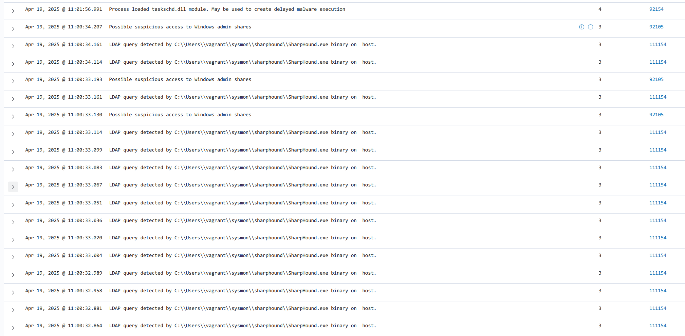
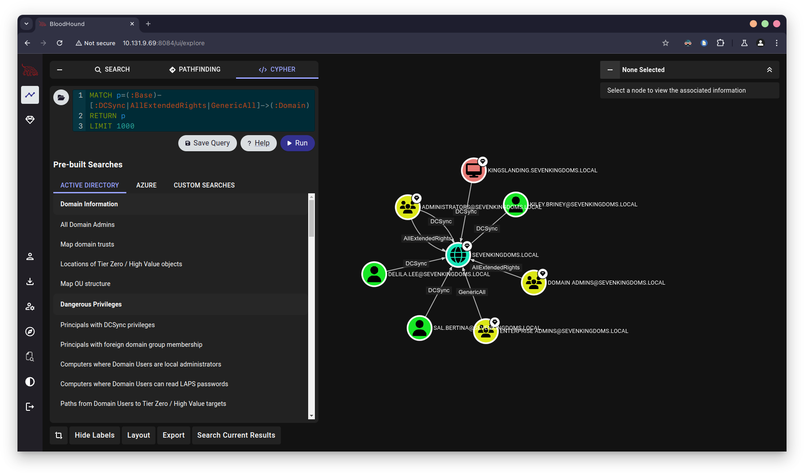
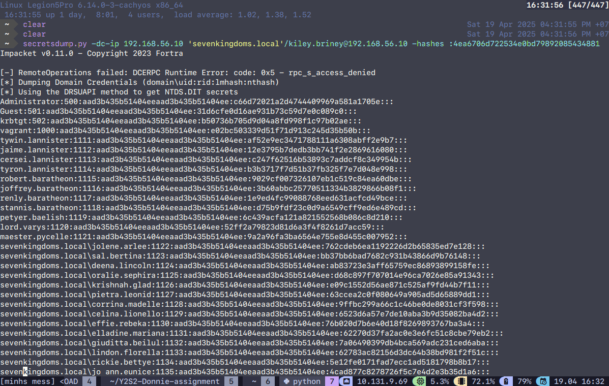
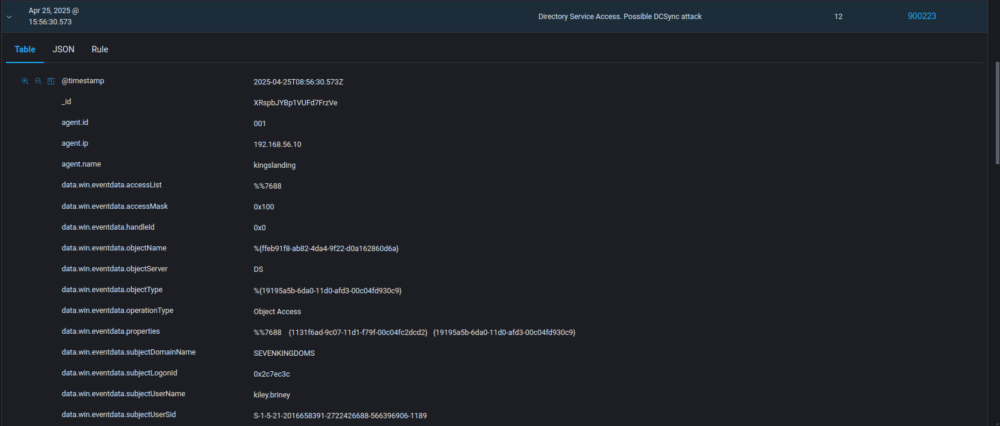
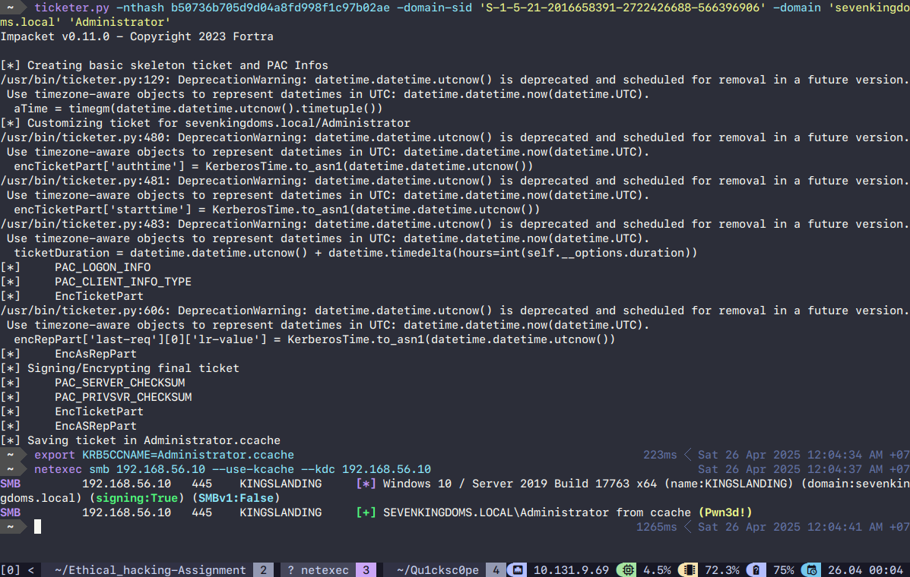
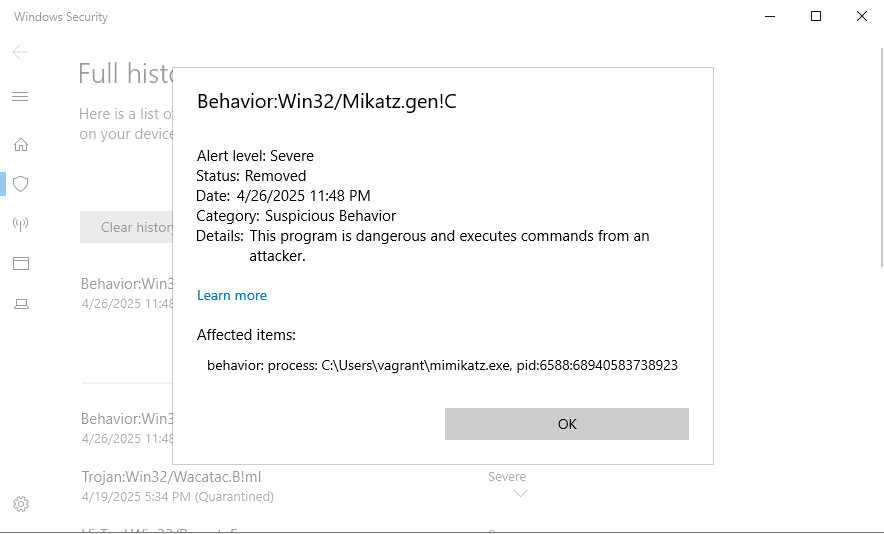

---
title: "Ethical Hacking Assignment"
author: [HAN23080181, HAN23080514, HAN23100188, HAN23100107, HAN23080227]
date: '2025-05-02'
toc: true
toc-own-page: true
lang: "en"
titlepage: true,
titlepage-text-color: "FFFFFF"
titlepage-rule-color: "360049"
titlepage-rule-height: 0
titlepage-background: "background.pdf"
toc-own-page: true
...

# **Title: Defensive Strategies Against the 5 Phases of Ethical Hacking: A Security Perspective**


# **1.Introduction**
"Ethical hacking is about building trust by uncovering weaknesses before adversaries exploit them." - Grimes, R. A. (2017)

Ethical hacking play a crucial role in role in enhancing cybersecurity defenses by probing system infrastructure to identify vulnerabilities exist in system. Through authorized and structure testing, ethical hackers stimulate real-time cyberattack to uncover potential security gaps. These actions are vital for strengthening organization security, resilience, protecting sensitive information, and ensuring operational continuity. In a era where cyberthreats evolve quickly and unpredictable, the implementation of ethical hacking practices is critical for maintaining trust, achieving regulatory compliance, and securing digital infrastructures against exploitation.

# **2.Main body**
##  2.1 What is Ethical Hacking?
### 2.1.1 Introduction to Ethical Hacking
Ethical hacking or **penetration testing**, or **white-hat hacking**, or **offensive security testing**, is the name for the system security inspection process of an organization or government through emulating an actual attack on the system of that organization. This action is taken to examine and identify potential security weakness existing in the system that can be exploited by malicious actors.
Ethical hacking has become an essential cornerstones in modern cybersecurity framework due to the development of cyber threats is increasingly complicated and difficult to solve, providing organizations or governments to detect and overcome potential weakness.

### 2.1.2 Definition and Scope
Ethical hacking is the use of exploitation techniques by ethical hacker or friendly parties in an attempt to discover, identify, understand and repair security weakness in a network, computer system, or organization's system before threat actors can exploit them.

The practice encompasses the following scopes:
- Network infrastructure testing
- Web and mobile application penetration testing
- Wireless security assessments
- Cloud service configuration audits
- Physical and social engineering attacks (within red team exercises)

### 2.1.3 Objectives of Ethical Hacking
Objectives of Ethical Hacking:
- Identifying Security Vulnerabilities: Detect the security vulnerabilities existing in organization's system, network, and applications that may be exploited.
- Risk Assessment and Prioritization: Examine the system defence and impact of identified weakness based on industry standards.
- Compliance Assurance: Meet the requirements and regulations in the contract.
- Incident Response Readiness: Simulate the cyberattack to examine the efficiency of organization's detection and mitigation procedures.
- Security Posture Improvement: Give direction and enhance the effectiveness of the system resilience.

### 2.1.4 Ethical and Legal Considerations
Ethical hackers must obey the laws, consensus as well as organization policies. Any deviation from the term that have been signed between the two parties can constitute the law violation such as:
- Computer Fraud and Abuse Act (CFAA) – United States
- General Data Protection Regulation (GDPR) – European Union
- Computer Misuse Act 1990 – United Kingdom

Before the inspection was conducted, a contract also know as **Rules of Engagement (RoE) document** must be signed. This document outline:
- Testing scope and exclusions
- Authorized tools and techniques
- Testing schedule
- Notification and escalation protocols

In short, ethical hacker must comply with the principle to avoid leaked sensitive information, and the effects may occur when the information is leaked, ensuring data confidentiality, integrity and availability.

##  2.2 What is Active Directory(AD)?
### 2.2.1 Introduction to Active Directory (AD).
Active directory is a eraction of different hierarchies developed by Microsoft that serves as the backbone of identity and access management (IAM) in Windows-based enterprise networks, enabling administrators to manage information stored on the network such as user data, security, and distributed resources  more efficient.

### 2.2.2 Core Components of Active Directory.
#### 2.2.2.1 Active Directory Domain Services (AD DS).
A directory services knows as Active Directory Domain Services (AD DS), enabling directory data such as authentication(names, passwords, phone numbers), user logon processes, and directory searches can be stored and available across network users and administrators. In addition, AD DS improve the effectiveness in resources management and security policies.

#### 2.2.2.2 Domain Controllers (DCs).
Domain Controllers work as a brain controlling AD DS including security policies and directory data. Moreover, they approve and validate all clients and components in Windows domain network.

#### 2.2.2.3 Organizational Units (OUs).
Organizational Units (OUs) has the lowest rank in the decentralization system of AD and the smallest administrative units in Domain that function as a container to store directory objects such as users, group, computers, and other components. OUs are the smallest gear in the system but also the most important for the system to operate smoothly and effectively.

#### 2.2.2.4 Group Policy Objects (GPOs).
Group Policy Objects (GPOs) is a set of setting that implemented defence policies to Active Directory environment to manage thousands of users and devices across Directory domain. Thus, enforcing organizational standards and security compliance.

Purpose and Application:
- Centralized Configuration Management: Allow administrators to implement regular configurations to users have been created in the environment in a defined scope (site, domain, or OU).
- User Configuration Settings: Including guiding related to AD environment such as desktop environment, network connections, software installation, folder redirection, and logon/logoff scripts.
- Computer Configuration Settings: 
- Security Enforcement: Including policies for startup/shutdown scripts, Windows security settings, registry settings, and service control.
- Software Deployment: GPOs act function as crucial part in Directory domain helping automate the installation, update, or removal of software applications across multiple machines. 
- Loopback Processing: Useful in environments like kiosks or classrooms, where a user’s settings are overridden by the computer’s GPO regardless of who logs in.

GPO Processing Order (LSDOU):
When multiple GPOs are in place, they are applied in the following order:
1. Local GPO
2. Site-level GPOs
3. Domain-level GPOs
4. OU-level GPOs (from parent to child)

If settings conflict, those applied later in the sequence (e.g., at the OU level) take precedence.

### 2.2.3 Security and Authentication.
Active Directory (AD) own strong security and authentication through various network protocols, including the three most important protocols are Kerberos, LDAP, and NTML - collectively ensure that users and devices are authenticated securely and efficiently, enabling access control across an organization’s infrastructure.

#### 2.2.3.1 Kerberos Authentication Protocol.
Kerberos is the essential protocol of Active Directory in Domain environments, acting as a mediator for trusted hosts and untrusted network to secure communication between two parties such as authenticating service.

Key features:
- Ticket-Based Authentication: Key Distribution Center (KDC), which is a part of domain controller, providing ticket issued for Kerberos to operate.
- Mutual Authentication: Authentication is performed in parallel between client and server, in order to mitigate the risk of impersonation attacks.
- Time-Sensitive Tokens: Kerberos tickets have expiration timestamps, reducing the risk of token reuse or replay attacks.

#### 2.2.3.2 LDAP (Lightweight Directory Access Protocol).
LDAP or Lightweight Directory Access Protocol is an open and neutral protocol using in AD to manage directory services and become a central location for accessing, providing communication language that applications require to send and receive information from directory services.

Key Functions in AD:
- Directory Searches: LDAP is used to look up directory objects such as users, groups, or computers.
- Authentication and Authorization: LDAP can validate credentials and determine access rights based on user attributes.
- Directory Modification: Using LDAP to add, delete, or modify AD objects.

#### 2.2.3.3 NTLM (NT LAN Manager).
NTML is one of the old protocols applied before Kerboros. While the modern Active Directory environment is still priority Kerberos rather than NTML, they still use NTML to help old systems do not support Kerberos compatible with the environment.

NTLM Characteristics:
- Uses a challenge-response mechanism for authentication.
- Does not provide mutual authentication, making it vulnerable to relay attacks.
- Still used in workgroup environments, local logons, and when Kerberos is unavailable.

##  2.3 What is HoneyPot?

Honeypots are fake services designed to be decoys to attract, surveil and identify potential threat actors. These decoys are deliberately vulnerable and exposed by design. (Crowdstrike)

##  2.4 Reconnaissance
Reconnaissance is the first step of cyberattack where threat actors try to gather information of target's system without direct interaction. In defensive site, blue team will try to reduce exposure of sensitive data in documents or code by minimizing publicly available data and deploying early detection mechanisms such as Honeypots, Wazuh.

Honeypot function as a decoy in network to distract potential attacker from essential data and machine in Directory domain. Combining Wazuh with Honeypot to analyze, correlate, and respond to these early signals. When Honeypot is being triggered, Wazuh will automate IP blocking and send real-time alerts to defenders of unauthorized access attempts

This combination of deception and correlation allows defenders to detect reconnaissance activities early, manage external exposure, and engage proactively before attackers escalate their operations.

##  2.5 Scanning and Enumeration
Scanning is the next step of cyberattack. In this phase, attackers try to identify open ports, live hosts, and services of target's system by probing the network environment.

In this phase, blue team implements network segmentation, firewalls, Access Control Lists (ACLs), and protocol such as **Zero Trust** principle to limit lateral movement. The goal of these actions is to trap and monitor scanning tools such as Nmap or Masscan.

Additionally, the combination between Wazuh and Honeypot enables security teams to detect known scanning behaviors, such as SYN floods or banner grabbing. When attackers attempt to scan the environments, Wazuh can automatically response to the unauthorized IP address, blocking the source IP and notify administrators.

In short, thanks to Honeypot and Wazuh, Blue Teams can detect, trace, and disrupt scanning attempts early—preventing attackers from building a useful map of the network.

##  2.6 Initial foothold.

Once the attackers had enough information, they would begin to gain foothold on the network by targeting external facing services such as RDP (Remote Desktop Protocol), Citrix, webapps, etc. In this case, the attackers managed to find an open RDP port on the external IP like the case of lapsus$. To deal with RDP abuse, this service shouldn't be open to outside in the first place, it should be hidden behind a VPN or be disabled entirely since according to Sophos, RDP is one of the most common tools attackers uses to gain access externally and move laterally within the network (John Shier, 2025). If RDP is to be opened externally, that endpoint should have it's security settings set to the max, the screen constantly screenshotted and a constant pcap packet capture of all instances. 

##  2.7 Maintaining access and Lateral Movement

Once the attacker had foothold, the next thing they would do is to move laterally in the network. Lateral Movement is a set of techniques and tactics attackers uses to move to a higher level targets in a network after gaining initial access, (CrowdStrike). One of the first thing attackers would do to move laterally in an Active Directory environment is to enumerate the domain using Bloodhound. Bloodhound is a graphing tool created by SpecterOps to audit the active directory objects for any unintended relationships or rights that can be abused to move laterally within an environment. The first step they would do is to dump information of the domain via SharpHound:


To detect this, we can use a Wazuh ruleset to with several indicators to detect SharpHound: 

- common strings "SpecterOps", "SharpHound", "Collection Method" inside of any binaries 
- abnormal LDAP queries 
- Creation of json files 
- null session enumeration




After the attackers managed to identify which is the target, they would proceed to move laterally in that domains: 



After identifying the accounts with replication rights, the attacker then proceeds to get the credentials of the kiley.briney user and used it with the secretsdump tool. DCSync is a feature for Domain Controllers to "sync" credentials with each other, and is only accessible to Administrators or users with the "DS-Replication-Get-Changes", "DS-Replication-Get-Changes-All" rights (Navali, 2024). 



To detect DCSync attacks, we will configure Wazuh to properly read the sysmon logs: 

```
  <rule id="110001" level="12">
    <if_sid>60103</if_sid>
    <field name="win.system.eventID">^4662$</field>
    <field name="win.eventdata.properties" type="pcre2">{1131f6aa-9c07-11d1-f79f-00c04fc2dcd2}|{19195a5b-6da0-11d0-afd3-00c04fd930c9}</field>
    <options>no_full_log</options>
    <description>Directory Service Access. Possible DCSync attack</description>
  </rule>
```

In this case, Wazuh will detect a 4662 event (An operation was performed on an object) and the GUID of the "DS-Replication-Get-Changes-All" and "DS-Replication-Get-Changes", indicating that a DCSync action had been performed on the network (Microsoft). After applying the rules to Wazuh, we will conduct another DCSync attack and Wazuh had successfully detected the attack: 




After getting all of the NTLM credentials of the domain, the Adversary would use the hash of the krbtgt account to forge a "golden ticket". A golden ticket is a post-exploitation tactic that adversary often uses to forge legitimate-looking Kerboros Ticket Granting Ticket with the stolen krbtgt NTLM hash which is used to encrypt TGTs (CrowdStrike). A stolen TGT can allow the adversary to become anyone on the domain, while being hard to detect as the ticket looks and operate legitimately unless the attacker make a mistake while creating the fake ticket (wrong domain names, invalid usernames).



The only way to prevent this is to rotate the KRBTGT password after a certain period (90-180 days) or right after the sign that there were a DCsync attack.

# **3. Malware Attacks and Remediation Plan**

By default, most Windows Machines came with Windows Defender antivirus, which by its own is pretty good at blocking malware and potential malicious actions:



AVs like Windows Defender works by actively scanning signatures of files to see if the hash of that file fits known malware samples or some even offers the ability to perform Heuristic Analysis, which looks for anything suspicious within that executable decomplied code that matches with known malwares or dynamic Analysis that run the code inside of a sandbox that would analyze it's behavior and API calls to determine if that executable is malicious or not (Kaspersky). 

But nowadays, attackers would abuse Fileless Malwares to evade Traditional AVs. Fileless Malwares abuses legitimate programs and function to deliver the payload straight to memory, leaving no tracts on hard drives. Attackers would often abuses vulnerable programs or Living off the Land (LOTL) binaries as a delivery system to execute the malware straight inside the memory, leaving no traces on the filesystem (CrowdStrike).

To deal with fileless malwares, large companies and governments had begun using EDR solutions like crowdstrike as the primary way to protect their endpoints. EDR, which is short for "Endpoint Detection and Response" is a cybersecurity solution that can help to better prevent, detect and stop threats on end-user machines (Microsoft). EDRs works by acting as a "black box" for endpoints, which collects information from the client such as Event Logs, Process infos, Traditional antivirus, file creation, logon information such as authentication attempts or users who are currently authenticated, etc. Then, instead of looking for traces of the attack, they would look for indicators of attacks, which are signs that something suspicious or out of the blue is happening, examples such as suspicious outgoing traffic, or match of known adversary TTPs (Tactics, Techniques and Procedures) from threat intelligence databases such as MITRE ATT&CK. EDRs can also monitor system memory and processes in real time to look for anomalies. Then, EDRs can be configured to automatically "quarantine" the client, alert the IT team and begin the process of purging it from the endpoint. 

# **4.Challenges in Securing Network**
Nowadays, modern networks evolve rapidly which increase complexity and interconnectedness, created pressure and challenges to modern security technologies. In addition, hybrid environments such as cloud, mobile, and IoT platforms significantly expand the surface that need to be secured. Although organizations often face advanced persistent threats (APTs), zero-day vulnerabilities, insider risks, and ransomware, the resources spent on security still limit due to budget constraints and a shortage of skilled professionals. Moreover, the growing of artificial intelligence enable attackers to leverage automation, requiring security team adapts new security strategies to ensure resilience and effective threat management.

# **5.Conclusion**
Ethical hacking function as fundamental of network safeguarding for organizations to implement better strategies against increasingly sophisticated cyber threats. It includes identify security weaknesses exist in infrastructure, strengthen network security, and the proactive monitoring of networks to detect and mitigate malicious activities. Ethical hackers apply different approaches to anticipate potential attack vectors and implement preventative measures more effectively. These actions are vital to ensuring CIA triad in organization. Additional, through regular assessment and improvement of security frameworks, ethical hacking enforces resilience of business network infrastructure, thereby upholding the stability and reliability of their digital infrastructures.

# **6.References**
- Stuttard, D., & Pinto, M. (2011). The Web Application Hacker’s Handbook: Finding and Exploiting Security Flaws (2nd ed.). Wiley Publishing.
- Weidman, G. (2014). Penetration Testing: A Hands-On Introduction to Hacking. No Starch Press.
- Microsoft (n.d.) Active Directory Domain Services overview. Microsoft Learn. Available at: https://learn.microsoft.com/vi-vn/windows-server/identity/ad-ds/get-started/virtual-dc/active-directory-domain-services-overview (Accessed: 13 April 2025).
- CrowdStrike (n.d.) What is a honeypot in cybersecurity?, CrowdStrike. Available at: https://www.crowdstrike.com/en-us/cybersecurity-101/exposure-management/honeypots/ (Accessed: 16 April 2025).
- Wikipedia. (2024). Honeypot (computing). [online] Available at: https://en.wikipedia.org/wiki/Honeypot_(computing) [Accessed 18 Apr. 2025].
- Wazuh. (2023). Wazuh documentation: Threat detection and response. Retrieved from https://documentation.wazuh.com/
- MITRE ATT&CK®. (2023). Enterprise attack matrix. Retrieved from https://attack.mitre.org/
- Offensive Security. (2024). Metasploit Unleashed: Scanning and enumeration. Retrieved from https://www.offensive-security.com/metasploit-unleashed/
- John Shier, A.G. (2025) It takes Two: The 2025 Sophos Active Adversary Report, Sophos. Available at: https://news.sophos.com/en-us/2025/04/02/2025-sophos-active-adversary-report/ (Accessed: 18 April 2025). 
- CrowdStrike (no date b) What is lateral movement? Available at: https://www.crowdstrike.com/en-us/cybersecurity-101/cyberattacks/lateral-movement/#:~:text=Lateral%20movement%20refers%20to%20the,and%20other%20high%2Dvalue%20assets. (Accessed: 18 April 2025).
- Shoyemi, A.D. (2024) Detecting Sharphound Active Directory activities, Wazuh. Available at: https://wazuh.com/blog/detecting-sharphound-active-directory-activities/ (Accessed: 19 April 2025). 
- Navali, V. (2024) DCSYNC attack protection against Active Directory, SentinelOne. Available at: https://www.sentinelone.com/blog/active-directory-dcsync-attacks/ (Accessed: 19 April 2025). 
- Pamnani, V. (no date) 4662(s, F) an operation was performed on an object. - windows 10, 4662(S, F) An operation was performed on an object. - Windows 10 | Microsoft Learn. Available at: https://learn.microsoft.com/en-us/previous-versions/windows/it-pro/windows-10/security/threat-protection/auditing/event-4662 (Accessed: 21 April 2025). 
- DS-replication-get-changes extended right - win32 apps (no date) Win32 apps | Microsoft Learn. Available at: https://learn.microsoft.com/en-us/windows/win32/adschema/r-ds-replication-get-changes (Accessed: 21 April 2025). 
- CrowdStrike (no date) What is a golden ticket attack?, CrowdStrike. Available at: https://www.crowdstrike.com/en-us/cybersecurity-101/cyberattacks/golden-ticket-attack/ (Accessed: 25 April 2025).
- Andress, J. (2014). The basics of information security: Understanding the fundamentals of InfoSec (2nd ed.). Syngress.
- Kim, D., & Solomon, M. G. (2016). Fundamentals of information systems security (3rd ed.). Jones & Bartlett Learning.
- Peltier, T. R. (2016). Information security policies, procedures, and standards: guidelines for effective information security management. CRC Press.
- Whitman, M. E., & Mattord, H. J. (2017). Principles of information security (6th ed.). Cengage Learning.
- Kaspersky (2018) What is heuristic analysis?, /. Available at: https://www.kaspersky.com/resource-center/definitions/heuristic-analysis (Accessed: 27 April 2025). 
- Crowdstrike (no date) What is fileless malware?, CrowdStrike. Available at: https://www.crowdstrike.com/en-us/cybersecurity-101/malware/fileless-malware/ (Accessed: 27 April 2025). 
- Microsoft (no date) What is EDR? endpoint detection and response: Microsoft security, What Is EDR? Endpoint Detection and Response | Microsoft Security. Available at: https://www.microsoft.com/en-us/security/business/security-101/what-is-edr-endpoint-detection-response (Accessed: 27 April 2025). 

# **7.Appendices**
No artificial intelligence (AI) tools were used in this assignmnet.
